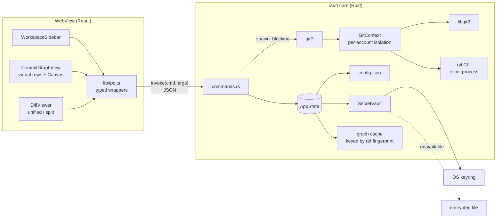
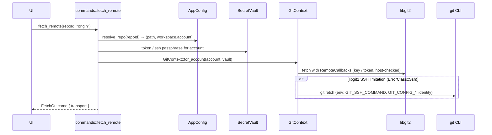
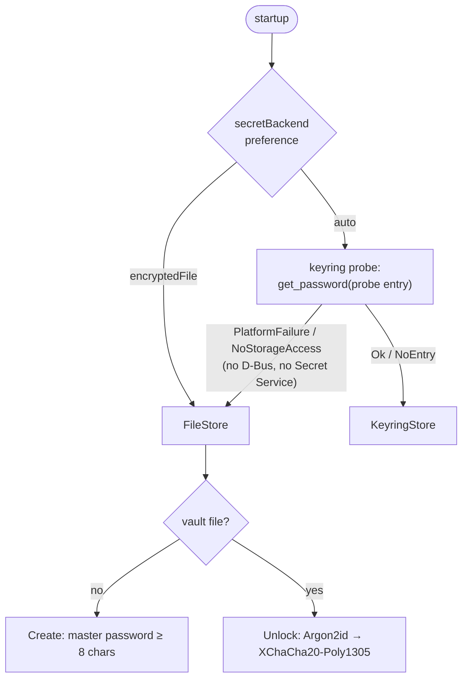
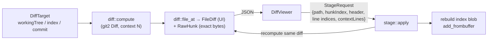
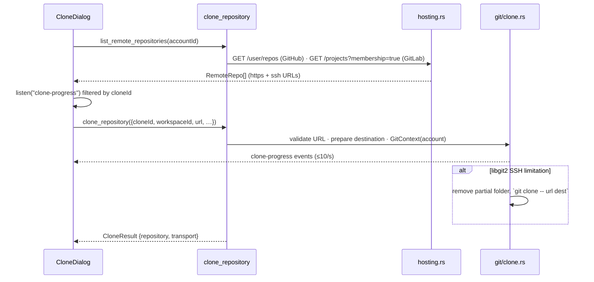

# OctoNode architecture

OctoNode is a desktop Git client for people who juggle several identities —
personal GitHub, work GitLab, a self-hosted GitLab, plain local repositories —
and need every operation to run as the right one, every time.

- **Shell:** Tauri 2 (stable line) with the system WebView: WebView2 on Windows,
  WKWebView on macOS, WebKitGTK 4.1 on Linux.
- **UI:** React 18 + TypeScript (strict) + Tailwind CSS 3.
- **Git:** `git2` 0.20 with vendored libgit2, plus the `git` CLI through
  `tokio::process` as a fallback for SSH setups libgit2 can't handle.
- **Secrets:** `keyring` 3.6 (Keychain / Credential Manager / Secret Service),
  falling back to an Argon2id + XChaCha20-Poly1305 encrypted file.

No alpha, beta, or RC crates or npm packages are used. Versions are pinned
exactly where the API surface is large (Tauri, plugins, npm), and by
semver-compatible minor where the crate is small and stable.

---

## 1. Repository layout

```
OctoNode/
├── index.html, vite.config.ts, tailwind.config.js, tsconfig*.json, package.json
├── src/                         # Frontend (React/TS)
│   ├── App.tsx                  # Shell layout, tabs, global shortcuts, dialogs
│   ├── main.tsx, index.css      # Entry + design tokens (CSS variables)
│   ├── types/models.ts          # 1:1 mirror of src-tauri/src/models.rs
│   ├── lib/
│   │   ├── ipc.ts               # Only place that calls invoke(); typed + IpcError
│   │   ├── platform.ts          # Mod key (Cmd/Ctrl), shortcut parse/match/format
│   │   ├── diffLayout.ts        # Context folding + split pairing (pure, tested)
│   │   ├── clone.ts             # Clone progress maths, folder names (pure, tested)
│   │   └── theme.ts             # Lane palette, avatar colors, relative time
│   ├── hooks/
│   │   ├── useCommitGraph.ts    # Paged, generation-guarded graph loader
│   │   └── useHotkeys.ts        # Global shortcuts (IME-safe, input-aware)
│   └── components/
│       ├── WorkspaceSidebar.tsx # Account rail + workspace/org/repo tree
│       ├── CommitGraphView.tsx  # Virtualized rows + Canvas DAG gutter
│       ├── DiffViewer.tsx       # Unified/split, folding, hunk/line staging
│       ├── SettingsDialog.tsx   # Master password, vault lock, clone folder
│       ├── CloneDialog.tsx      # Browse account repos / URL, progress, cancel
│       ├── Dialogs.tsx, Modal.tsx, Avatar.tsx
└── src-tauri/                   # Backend (Rust)
    ├── Cargo.toml, build.rs, tauri.conf.json, capabilities/default.json
    └── src/
        ├── main.rs / lib.rs     # Entry; builder, plugins, command registration
        ├── error.rs             # AppError → serialized { kind, message }
        ├── models.rs            # Account, GitHostType, Workspace, CommitNode, Hunk…
        ├── paths.rs             # AppDirs, canonicalization, quoting, atomic writes
        ├── config.rs            # config.json (non-secret), transactional updates
        ├── state.rs             # AppState: config, vault, graph cache
        ├── commands.rs          # Tauri IPC surface
        ├── hosting.rs           # GitHub / GitLab repository listing
        ├── secrets/             # SecretVault → KeyringStore | FileStore
        └── git/
            ├── context.rs       # Per-account isolation (credentials, SSH, identity)
            ├── cli.rs           # `git` via tokio::process with isolation applied
            ├── remote.rs        # fetch: libgit2 first, CLI fallback
            ├── clone.rs         # clone: progress, cancel, cleanup, CLI fallback
            ├── graph.rs         # Lane layout of the commit DAG
            ├── diff.rs          # git2 deltas → structured hunks
            ├── stage.rs         # Hunk/line (un)staging by index-blob rebuild
            └── integration_tests.rs
```

## 2. Runtime overview



The webview never sees filesystem paths it could abuse. It addresses
repositories by UUID, and the backend resolves paths from persisted config.
libgit2, Argon2 and the graph layout are blocking work, so they always run on
`spawn_blocking` and never on the IPC threads.

## 3. Multi-account isolation



The account is attached to the **workspace**, so every repository in a
workspace inherits it. `GitContext` is built for each call. Nothing is stored
in process-global state, so operations for different accounts can run at the
same time.

| Concern | libgit2 path | `git` CLI path |
|---|---|---|
| SSH key | `Cred::ssh_key(user, key, passphrase)` from the account; agent only if allowed | `GIT_SSH_COMMAND="ssh -i \"key\" -o IdentitiesOnly=yes -o BatchMode=yes"` |
| HTTPS token | `Cred::userpass_plaintext`, **only** if the URL host matches the account (`https` only) | `GIT_CONFIG_*` → `http.https://<host>/.extraHeader` scoped to the account host |
| Other accounts' cached creds | libgit2 never calls credential helpers | `credential.helper=` (empty) resets helpers; `GIT_ASKPASS=""`, `GCM_INTERACTIVE=never` |
| Author / committer | `GitContext::signature()` | `GIT_AUTHOR_*`, `GIT_COMMITTER_*`, `user.name/email` via `GIT_CONFIG_*` |
| Runaway auth loops | callback capped at 3 attempts | `GIT_TERMINAL_PROMPT=0`, 300 s timeout, `kill_on_drop` |

`IdentitiesOnly=yes` matters because without it, `ssh` offers every key in the
agent first, and GitHub then authenticates you as whichever account's key it
sees first.

Isolation is per process and never touches `~/.gitconfig`. The opt-in command
`bind_repository_identity` writes `user.name`, `user.email` and
`core.sshCommand` into the repository's own `.git/config`, so a terminal in
that folder behaves the same as the app.

### Secret storage



- The probe only **reads** (it never writes), so it doesn't touch the keychain
  on macOS or Windows.
- File format: versioned JSON with the KDF parameters stored in it (64 MiB,
  t=3, p=1 by default), a random 24-byte nonce for every save, and AAD bound
  to the format version. A wrong password and a tampered file produce the same
  error, so the error itself reveals nothing.
- In memory, secrets are `Zeroizing<String>`, and the key is wiped on lock.
  Writes are atomic (temp file → fsync → rename) and the file is `0600` on Unix.
- Tokens never go into `config.json`, and they are never sent to the webview.

## 4. Commit graph

### Layout algorithm (`git/graph.rs`)

The revwalk visits every local and remote branch, every tag, and a detached
HEAD, sorted `TOPOLOGICAL | TIME`. `lanes[k]` holds the commit that lane *k* is
waiting for.

1. **Place:** the commit takes the leftmost lane that expects it, or a free
   slot. Any other lane expecting the same commit converges into it and is
   freed.
2. **First parent:** inherits the lane, which keeps the mainline straight. If
   the parent already has a lane, a *bend* into that lane is queued instead.
3. **Other parents:** join their existing lane (as a bend) or open a new lane
   with a new color.

Each row stores only its **incoming** segments, `[fromLane, toLane, color]`,
running from the previous row's centre to its own. So any window of rows can be
drawn on its own, and virtualization needs nothing from rows outside the
window.

```
row r-1   ●───┐            edges of row r: [0,0,c0] [1,0,c1]  (lane 1 converges)
row r     ●◄──┘
```

A ref fingerprint (a hash over every ref target plus HEAD) is the cache key, so
the layout is recomputed only when a ref actually moves. The UI fetches pages
of 400 rows (`get_commit_graph(repoId, offset, limit)`).

**Measured:** rust-lang/cargo has 24,162 commits and 21 lanes. Layout takes
about 0.4 s in a release build, and a 500-row page is about 180 KiB of JSON. The
invariants test (topological order, every parent receives an edge into its
lane, all lanes in bounds) passes on that history.

### Rendering (`CommitGraphView.tsx`)

- `@tanstack/react-virtual` keeps a fixed 28 px row height, so there is no DOM
  measuring and only about 40–60 rows are mounted at any history size.
- A single `<canvas>` is sized to the visible window plus one row above and one
  below. It is positioned inside the scroll content and redrawn in
  `useLayoutEffect`, scaled for `devicePixelRatio`.
- Segments are drawn as straight lines or cubic S-curves. Nodes are filled
  dots; merge commits are rings; HEAD and the selected commit get a halo.
- The graph column can be resized by dragging its header (double-click to fit).
  Lanes past its edge are clipped.
- Keyboard: ↑/↓, PgUp/PgDn, Home/End.

## 5. Diffs and staging



- **Targets:** `workingTree` (index → workdir, untracked files included),
  `index` (HEAD → index; an unborn HEAD is handled), and `commit` (first parent
  → commit, with rename detection).
- **Context folding:** "Full file" asks for context = 1,000,000. Long unchanged
  runs are then folded on the client (`foldHunk`), keeping three lines of
  context next to each change; click a fold to expand it. Diffs at normal
  context fold too.
- **Split view:** `toSplitRows` pairs each deletion block with the addition
  block that follows it.
- **Line staging** doesn't build patches. It rebuilds the target **index blob**:
  - *stage* works on the index → workdir diff, using the old side as the base;
  - *unstage* works on the HEAD → index diff, using the new side as the base;
  - one rule covers both: *selected base-side lines disappear, selected
    foreign-side lines appear.*

  Each base line touched is compared byte for byte with the diff the UI showed.
  The hunk header and the index blob id are checked too, and any mismatch fails
  as `stale`, never as a wrong write. This sidesteps three problems with
  generated patches: path quoting, CRLF filters, and "\ No newline at end of
  file" bookkeeping.
- **Limits:** 20,000 lines per file. Over the limit, the file is marked
  `truncated` and can only be staged as a whole file. Binary, renamed, added and
  untracked files are also staged as whole files only.
- The diff list is virtualized too, with fixed row heights per row type.

## 6. Cloning and settings

### Cloning (`git/clone.rs`, `hosting.rs`)



- **Allowed URLs:** only `https://`, `ssh://`, `git://` and scp-like
  `user@host:path`. `file://`, local paths, Windows drive paths, `ext::` and
  other helper transports, and arguments starting with `-` are rejected. On the
  CLI, `--` comes before the URL and path, so neither can be read as an option.
- **Destination:** the folder must not exist, or must be empty. Folder names are
  checked against Windows naming rules on every OS, so a name that works on
  Linux won't fail on Windows.
- **Cancel:** the libgit2 transfer callback returns `false` once the flag is
  set. The flag is also checked before and after the transfer, because local
  transports never call that callback. A failed or cancelled clone is always
  removed.
- **Proxies:** `ProxyOptions::auto()` makes libgit2 honour `http.proxy` and
  `HTTPS_PROXY`, the same way the git CLI does. Fetch uses the same setting.
- **Hosting API:** reqwest 0.12 with rustls on `ring` and the OS certificate
  store, so a self-hosted GitLab behind a corporate CA works. Redirects are
  never followed. The token header is marked sensitive, and request URLs are
  stripped from error messages. Results come 100 per page, up to 1,000 repos.

### Master password change (`secrets/file_store.rs`)

1. Requires an unlocked vault. The *current* password is checked against the
   file on disk, so a vault replaced since it was unlocked can't be re-keyed
   blindly.
2. Generates a fresh 16-byte salt and derives a new key with the current KDF
   profile, which also upgrades an older vault's Argon2 cost.
3. Re-encrypts every secret and writes the file atomically. If the write fails,
   memory goes back to the old key, which matches what is still on disk.

The vault stays unlocked throughout, so tokens keep working and nothing needs a
restart. With the OS keychain backend there is no master password, and the
Settings panel says so.

## 7. Cross-platform strategy

### Paths
| Rule | Where |
|---|---|
| App directories come from `directories::ProjectDirs("dev","OctoNode","OctoNode")`, e.g. `~/.config/octonode`, `~/Library/Application Support/dev.OctoNode.OctoNode`, `%APPDATA%\OctoNode\OctoNode\config` | `paths::AppPaths` |
| Paths stay `PathBuf` inside the backend; they become strings only for display or for shell-parsed values | `paths.rs` |
| Canonicalize with `dunce`, so Windows never gets `\\?\C:\…`, which libgit2 and OpenSSH reject | `paths::canonicalize` |
| Git paths are always `/`-separated; converting them to native paths rejects `..` and empty components | `paths::git_relative` |
| `GIT_SSH_COMMAND` paths use forward slashes and double quotes with `\ " $ \`` escaped, because Git for Windows runs the value through `sh` too | `paths::shell_quote_for_git` |
| Config and vault are written atomically (rename replaces the file on Windows too); the vault is `0600` on Unix | `paths::atomic_write` |
| Repositories are opened with `NO_SEARCH`, so a stale entry can't resolve to a parent repository | `git::open` |
| The frontend computes basenames with both separators | `platform.ts::basename` |

### Keyboard shortcuts
Shortcuts are written once with an abstract `Mod`:

| Spec | macOS | Linux / Windows |
|---|---|---|
| `Mod+1…9` switch account | ⌘1…⌘9 | Ctrl+1…9 |
| `Mod+Shift+F` fetch | ⇧⌘F | Ctrl+Shift+F |
| `Mod+R` refresh | ⌘R | Ctrl+R |
| `Alt+1/2` History / Changes | ⌥1 / ⌥2 | Alt+1 / Alt+2 |
| `Alt+V` unified ↔ split | ⌥V | Alt+V |

- The backend's `PlatformInfo` is the source of truth for the OS; the user
  agent is only a fallback before bootstrap finishes.
- `Mod` matches exactly: on macOS, Ctrl+K does **not** trigger ⌘K.
- With Option held, macOS produces composed characters (⌥V → `√`), so
  letters and digits fall back to the physical `event.code`.
- Shortcuts are ignored during IME composition. Shortcuts without modifiers are
  ignored while focus is in a text field.
- Labels follow each platform's conventions: Apple's ⌃⌥⇧⌘ order on macOS,
  `Ctrl+Shift+P` elsewhere.

### System calls and processes
- `tokio::process::Command` uses `kill_on_drop`, a timeout, `stdin(null)` and
  `LC_ALL=C`. On Windows it also sets `CREATE_NO_WINDOW`, so no console windows
  flash. The `git` binary is found through `PATH`, or `OCTONODE_GIT` overrides
  it.
- `GIT_TERMINAL_PROMPT=0`, an empty `GIT_ASKPASS`/`SSH_ASKPASS` and
  `GCM_INTERACTIVE=never` mean background operations can't hang on a prompt.
- Native dialogs (open folder, pick key) come from `tauri-plugin-dialog`. The
  app doesn't use `window.prompt` or `window.confirm`, because they behave
  inconsistently across WebViews.

### WebView baselines
Build targets are `chrome105` (WebView2) and `safari13` (macOS 10.15+ and
WebKitGTK). The UI uses only well-supported CSS: no container queries, no
`:has()` in critical paths. Scrollbars are themed through `::-webkit-scrollbar`,
which WebKitGTK and WebView2 both support.

## 8. Error handling

- `AppError` (thiserror) covers git, io, serialization, secretStore,
  vaultLocked, invalidPassword, notFound, invalidInput, stale, unsupported,
  remote, authRequired, cancelled, process and internal errors. It serializes as `{ kind, message }`.
- **Authentication errors.** The credential callback records *why* it could
  not authenticate (`AuthProblem`: missing token, locked vault, no SSH key,
  token host mismatch, credentials rejected). `GitContext::explain` turns the
  generic libgit2 error into `AppError::AuthRequired`, with a message that names
  the account and the fix. These errors are never retried with the git CLI, which
  could pick up credentials from outside the account.
- **Selectable errors.** The shell disables text selection. Error text opts back
  in (`.selectable`, with the `-webkit-` prefix for WebKitGTK and WKWebView)
  through the `ErrorText` component, which also has a Copy button.
- The frontend wraps every rejection in `IpcError` with a typed `kind`. The UI
  reacts to specific kinds: `vaultLocked` reopens the unlock dialog, and
  `stale` reloads the diff and asks the user to retry.
- Production code has no `unwrap()` or `expect()`. Poisoned locks map to
  `AppError::Internal` instead of cascading panics. A corrupt `config.json` is
  moved aside, never silently overwritten. Config updates are transactional:
  the draft is saved first and swapped in only after the save succeeds.
